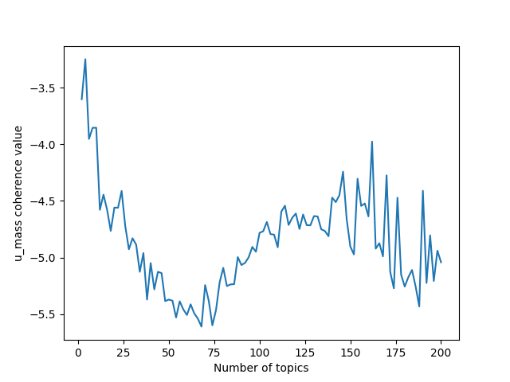

# Todo list
Weekly meeting at 2:30
## in meetings

### current progress
- assembling list of topic general words (contextually non informative)

- Confirm:

  directions = {"north", "northern", "south", "southern", "east", "eastern", "west", "western", "northeast", "northeastern", "northwest", "northwestern", "southeast", "southeastern", "southwest", "southwestern", "centre", "central", "center", "upper", "lower", "high", "low"}

  geographic names = {"country", "río", "mexico", "australia", "eu", "europe", "european", "africa", "african", "madagascar", "atlantic", "brazil", "america", "american", "united", "states", "usa", "ecuador", "columbia", "papua", "guinea", "china", "spain", "queensland", "india", "thailand", "mediterranean", "republic", "indonesia", "viet", "nam", "italy", "france", "pacific", "malaysia", "asia", "zealand", "caledonia", "congo", "florida", "cape", "san", "california", "peru", "colombia", "sierra", "argentina", "cameroon", "mozambique", "parque", "iran", "netherland", "persian", "germany", "myanmar", "costa", "rica", "panama", "tanzania", "venezuela", "ireland", "bolivia", "japan", "solomon", "nigeria", "gabon", "turkey", "borneo", "canada", "kenya", "wale", "indian", "indo", "philippine", "sumatra", "bay", "mexican", "texas", "carolina", "cuba", "algeria", "ethiopia", "austalian", "gulf", "sri", "lanka", "sarawak", "portugal", "greece", "russia", "sabah", "nepal", "kalimantan", "switzerland", "malawi", "austria", "morocco", "nord", "uganda", "czech", "hungary", "romania", "angola", "los", "angeles", "cordillera", "victoria", "lao", "amazon", "madeira", "canary", "chile", "iberian", "taiwan", "zambia", "tunisia", "korea", "norway", "israel", "egypt", "slovakia", "leone", "caribbean"}

  habitat = {"habitat", "coastal", "coast", "reef", "river", "island", "lake", "sea", "marine", "stream", "water", "forest", "mountain", "montane", "tree", "plant", "elevation", "altitude", "grassland", "highland", "lowland", "woodland", "tropical", "basin", "rocky", "bank", "hill", "cave", "valley", "rock", "mainland", "herbarium", "plantation", "freshwater"}

  others = {"specie", "species", "subspecie", "assess", "assessment", "find", "occur", "occurrence", "record", "know", "area", "unknown", "know", "known", "year", "population", "available", "protect", "protection", "conservation", "distribution", "need", "major", "collect", "collection", "survey", "red", "list", "listing", "need", "criteria", "s", "asl", "bcgi", "annex", "current", "currently", "ex", "situ", "require", "include", "report", "extent", "location", "locality", "subpopulation", "habitat", "site", "place", "information", "research", "trend", "action", "number", "measure", "range", "new", "concern", "measure", "specific", "estimate", "individual", "datum", "national", "park", "management", "status", "likely", "province", "consider", "region", "cause", "result", "usually", "near", "remain", "monitor", "taxon", "overall", "suspect", "affect", "threat", "threaten", "state", "global", "establish", "threshold", "important", "plan", "km²", "suggest", "recently", "describe", "quantify", "de", "appendix", "ii", "monitoring", "appear", "recommend", "increase", "decrease", "specimen", "speciman", "relatively", "wide", "widely", "criterion", "approach", "distribute", "infer", "probably", "recent", "present", "fairly", "common", "locally", "main", "evidence", "significant", "study", "genus", "peninsula", "cite", "potential", "taxonomy", "taxonomic", "lack", "legislation", "necessary", "critically", "endanger", "vulnerable", "ongoing", "extinct", "least", "presumably", "specifically", "possibly", "type", "little", "think", "additional", "confirm", "programme", "outside", "rarely", "associate", "mt", "mount", "awareness", "sub", "direct", "variety", "abundant", "future", "mainly", "et", "al", "unlikely", "believe", "peninsular", "follow", "la", "different", "adjacent", "reason", "evaluate", "discover", "document", "aoo", "eoo", "particular", "avoid", "benefit", "requirement", "beneficial", "generally", "refer", "continue", "class", "view", "seven", "classify", "category", "department", "numerous", "democratic", "entire", "approximately", "occupancy", "exist", "apparently", "indicate", "possible", "define", "determine", "district", "restrict", "previously", "occassionally", "typically", "reach", "total"}

- training models on HPC, with 50% of dataset

- implemented bigrams (not very effective). 
  Current parameters: appear at least 5 times in corpus (tested 5 to 10), and threshold (score for forming phrases, higher means fewer phrases) of 10 (tested 10 to 200)

- 

## coherence plot

Coherence values using the u_mass metric, from 2 to 100 topics. Graph peaks at 4 topics.

# 2 topics

Topic 0:

Topic 1: widespread decline of small endemic species in forests

# 4 topics

Topic 0: loss of forest due to use and trade

Topic 1: 

Topic 2: decline of endemics

Topic 3: fish use_trade

# 6 topics

Topic 0: human destruction of forests

Topic 1: forested areas

Topic 2: fish use_trade

Topic 3: freshwater fish and birds breeding related

Topic 4: endemic island species

Topic 5: impacts of trade and use causing decline

### what I will do 

- split up script to run in an array (check how to do)
  
  import model optimization function into another script, use os to retrieve PBS index array, set as iter
  
  insert iter into function to run

- keep on cleaning

- read papers and write intro and methods

- try model per column

### questions

## overall
- read papers
- read both lda and extinction papers, lean toward biology

## thought process
don't combine columns first, start with cleaning before applying lda so the individual columns can be distinguished

Two options: start with option 1 then try 2 if possible
1) train 1 model and apply to every column
  - create 1 dtm, with every single word from all the columns of focus

2) train 1 model for each column
  - create 1 dtm for every column

current dataframe
      |  rationale      |  habitat     |  threats     |  etc
doc1  |  doc1rationale  |  doc1habitat |  doc1threats |
doc2  |  doc2rationale  |  doc2habitat |  doc2threats |
etc

doc1rationale is the tokenized list of words

document term matrix
                | word1 | word2 | word3 | etc
  doc1rationale |   1   |   0   |   1   |
  doc1habitat   |   0   |   1   |   2   |
  doc1threats   |   0   |   4   |   1   |
  doc2rationale |   1   |   2   |   0   |
  etc